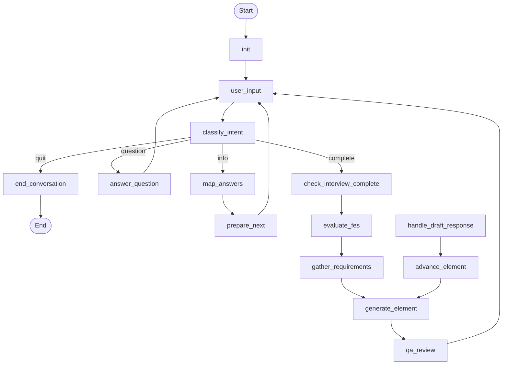

# Graph Export Procedure

> **Last Updated**: 2026-01-14

---

## Overview

PD3r can export the conversation graph as Mermaid syntax (`.mmd`) or PNG image for visualization.

---

## Automatic Export

The graph is automatically exported to `output/graphs/main_graph.mmd` when:
- Tests run (via `conftest.py`)
- The main application starts

---

## Manual Export

### Mermaid Syntax

```python
from src.graphs import pd_graph
from src.graphs.export import get_mermaid_syntax

mermaid = get_mermaid_syntax(pd_graph)
print(mermaid)

# Save to file
with open("output/graph.mmd", "w") as f:
    f.write(mermaid)
```

### PNG with Timestamp

```python
from src.graphs import pd_graph
from src.graphs.export import export_graph_png

success = export_graph_png(pd_graph, "output/graph.png")
```

---

## How PNG Export Works

1. Graph is converted to Mermaid syntax
2. Mermaid CLI (`mmdc`) renders to PNG
3. Pillow adds timestamp overlay to top-right corner
4. File is written to output path

---

## Requirements

### For Mermaid Syntax (always available)
No external dependencies.

### For PNG Export

```bash
# Install mermaid-cli globally
npm install -g @mermaid-js/mermaid-cli

# Verify installation
mmdc --version

# Install Pillow for timestamp overlay
poetry add pillow
```

---

## Viewing Mermaid Files

### VS Code
Install "Mermaid Preview" extension, then open `.mmd` file and press `Ctrl+Shift+V`.

### GitHub
Mermaid is rendered natively in GitHub markdown. Wrap in:
````

````

### Online
Paste into [Mermaid Live Editor](https://mermaid.live/)

---

## Generated Graph Structure

The current graph looks like:



---

## Troubleshooting

### PNG Not Generated

1. Check mermaid-cli is installed:
   ```bash
   mmdc --version
   ```

2. Check output directory exists:
   ```bash
   mkdir -p output/graphs
   ```

3. Check for Pillow:
   ```bash
   poetry run python -c "from PIL import Image; print('OK')"
   ```

### Timestamp Missing

Pillow is optional. If not installed, PNG is generated without timestamp.

```bash
poetry add pillow
```

### Graph Looks Wrong

The fallback Mermaid generation may be outdated. Check `src/graphs/export.py` and update the manual graph definition if needed.
